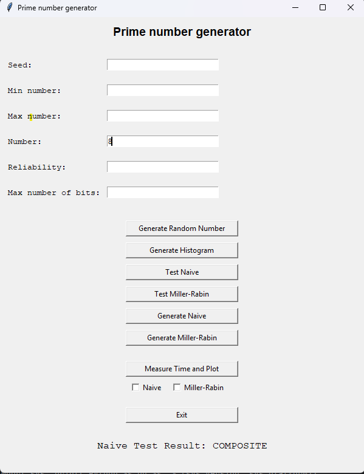
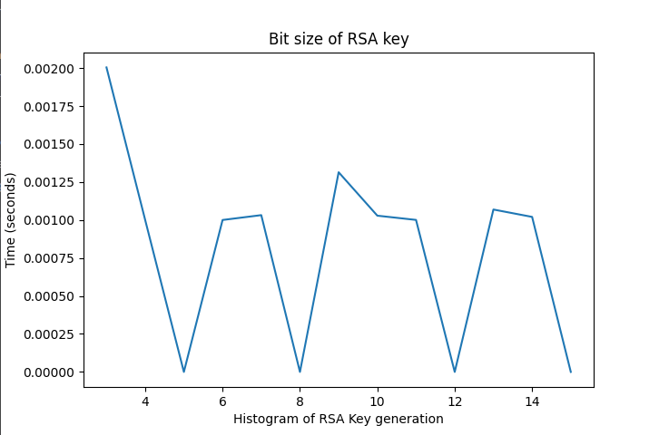

# Naloga 1 - Praštevila in RSA

## Naloga 1.1

---
### Tvorjenje naključnih števil
Nalogo sem pričel tako da sem ustvarili generator naključnih števil LCG z parametri Super-Duper.

**Histrogram 1000000 naključnih števil na intervalu [1, 1000]**

    
    

Ugotovitve: Generator deluje pravilno, saj so verjetnosti pojavitve posameznega števila relativno blizu.

---
### Generiranje preštevil

V GUI sem dodal možnosti za:
- Testiranje poljubnega števila z testom Miller-Rabin

    
    

- Testiranje poljubnega števila z naivnim testom

    
    

- Generiranje praštevila z testom Miller-Rabin
- Generiranje praštevila z naivnim testom
- Izris grafa za generiranje praštevil glede na n (bite števila) in čas generiranja
  - n -> [4, 32]
  - generiranjem sem zagnal tri krat in izračunal povprečje ter ga vstavil v graf
  - 

      
      
    

  - Nato sem grafa obeh algoirmtov še primerjal (oranžna - Miller-Rabin, modra: Naiven pristop)
  - 

      
    

**Ugotovitve**: Opazimo da pri naivnem pristopu čas generiranja nasrašča skoraj da exponentno glede na število bitov
zgeneriranega praštevila, medtem ko pristop z Miller-Rabin testiranjem bolj ali manj ohranja isto časovno zahtevnost.

## Naloga 1.2

V implementaicji naloge 1.2 se je podprla implementacija kriptiranja in dekriptiranja datotek z algoritmom RSA,
v kateri sem za ustvarjanje ključev uporabljal generator praštevil ustvarjen v nalogi 1.1.

**Posodobljen GUI**

      

---

### Generiranje ključev

**Primerjava generiranja ključev generiranjem ključev** z različnima metodama generiranja praštevil 
(ključi so bili generirani v naslednjih bitnih velikostih: [3, 4, 5, 6, 7, 8, 9, 10, 11, 12, 13, 14, 15]).
- Naivna metoda

      

- Miller rabin

      

- Primerjava obeh na enem grafu

      

---

## Enkripcija/Dekripcija datotek

**Primerjava časa izvajanja enkripcije in dekripcije** poljubnega n bitnega števila (n je bil na intervalu [3, 4, 5, 6, 7, 8, 9, 10, 11, 12, 13, 14, 15],
ob enem pa je na RSA ključ bil tudi n biten). Vsako iteracijo se je izvedlo 5 enkripcij in dekripcij z RSA algoritmom in se v graf vstavilo povprečje za n.

      

